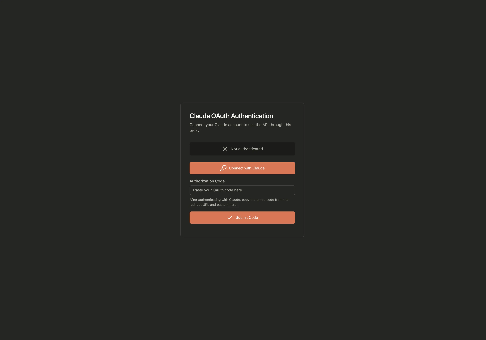
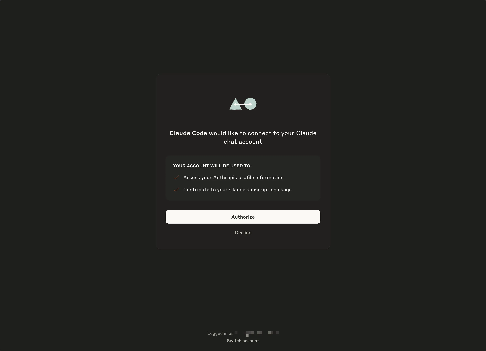
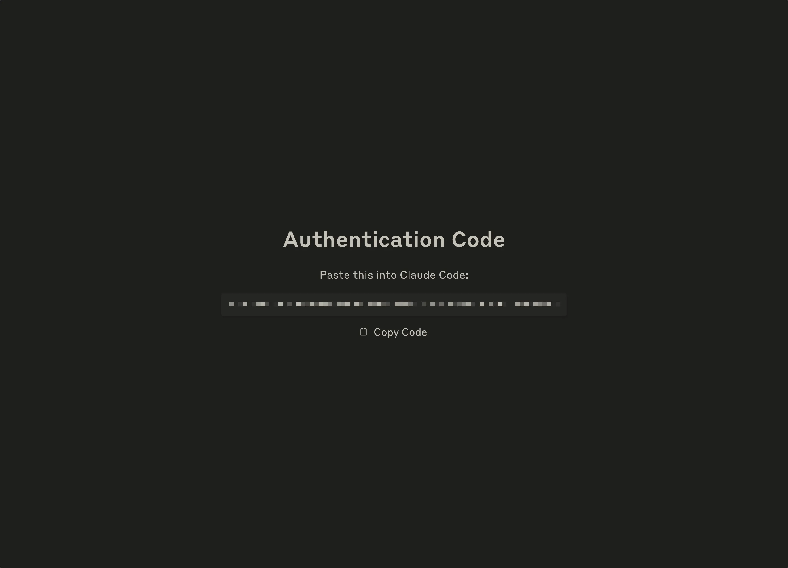
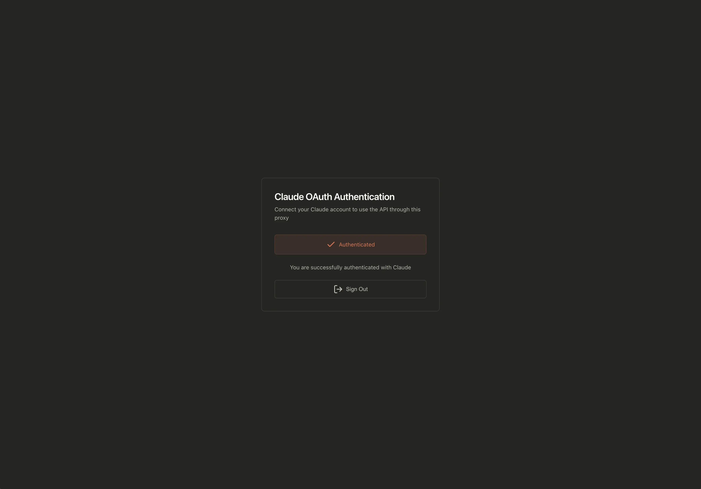
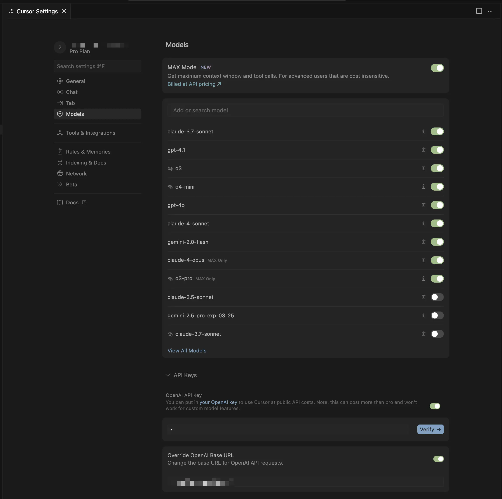

# 🚀 Deployment Guide - Cursor Claude Connector

This guide will help you connect Cursor with your Claude subscription using this proxy.

## 📋 Prerequisites

1. **Active Claude subscription** (Pro or Max)
2. **Cursor IDE** installed on your local machine
3. **GitHub account** (for Vercel deployment)

## 🔀 Two modes

| Mode | Storage | When to use |
|------|---------|-------------|
| **Local** | File `.auth/credentials.json` | Dev on one machine, maximum security |
| **Vercel** | Redis (Upstash) | Multi-device access, no PC required |

> On Vercel (serverless), file storage doesn't persist between requests. Redis is required.

---

## ☁️ Option 1: Deploy to Vercel

### One-click deploy

[](https://vercel.com/new/clone?repository-url=https://github.com/Maol-1997/cursor-claude-connector&env=API_KEY&integration-ids=oac_V3R1GIpkoJorr6fqyiwdhl17)

1. Set `API_KEY` when prompted (required for public URL)
2. Add Redis via Marketplace (see below)
3. Redeploy to apply environment variables

### Add Redis via Vercel Marketplace (recommended, free tier)

> **Vercel KV** was discontinued in December 2024. Use **Upstash Redis** from the [Vercel Marketplace](https://vercel.com/marketplace?category=storage&search=redis) — same REST API, **free tier** included (256 MB storage, 500K commands/month).

**Step-by-step:**

1. Open your project on [Vercel Dashboard](https://vercel.com/dashboard)
2. Go to the **Storage** tab
3. Click **Connect Store** → **Browse Marketplace**
4. Search for **Redis** → Select **[Upstash](https://vercel.com/marketplace/upstash)**
5. Click **Add Integration** → Create new database or link existing
6. Credentials (`UPSTASH_REDIS_REST_URL`, `UPSTASH_REDIS_REST_TOKEN`) are auto-injected
7. **Redeploy** your project for env vars to take effect

### Manual Redis setup

1. Create a database at [Upstash Console](https://console.upstash.com/)
2. Add these variables to Vercel (Settings → Environment Variables):
   - `UPSTASH_REDIS_REST_URL`
   - `UPSTASH_REDIS_REST_TOKEN`
   - `API_KEY` (required for public URL)
   - `CORS_ORIGINS` (your Vercel URL)

### After deployment

1. Visit `https://your-app.vercel.app/` to authenticate
2. Configure Cursor: Base URL `https://your-app.vercel.app/v1` + API Key

---

## 💻 Option 2: Local or VPS server

### Local mode (no Redis)

```bash
git clone https://github.com/Maol-1997/cursor-claude-connector.git
cd cursor-claude-connector
cp env.example .env
npm run start:local
# or: ./start.sh local
```

### Server mode (with Redis)

For a VPS or testing Vercel mode locally:

1. Add `UPSTASH_REDIS_REST_URL` and `UPSTASH_REDIS_REST_TOKEN` to `.env`
2. Run `npm run start:vercel` or `./start.sh vercel`

### Start scripts

| Script | Command | Storage |
|--------|---------|---------|
| `npm run start:local` | `./start.sh local` | File (`.auth/`) |
| `npm run start:vercel` | `./start.sh vercel` | Redis (requires env) |
| `npm run start` | `./start.sh` | Auto-detect |

## 🔐 Claude Authentication

### 1. Access the web interface

Open your browser and navigate to:

```
http://your-server-ip:9095/
```

Or if using a custom port:

```
http://your-server-ip:YOUR_PORT/
```



### 2. Authentication process

1. Click **"Connect with Claude"**

   

2. A Claude window will open for authentication
3. Sign in with your Claude account (Pro/Max)
4. Authorize the application

   

5. You'll be redirected to a page with a code
6. Copy the ENTIRE code (it includes a # in the middle)
7. Paste it in the web interface field
8. Click **"Submit Code"**

### 3. Verify authentication

If everything went well, you'll see the message: **"You are successfully authenticated with Claude"**



## 🖥️ Cursor Configuration

### 1. Open Cursor settings

1. In Cursor, press `Cmd+,` (Mac) or `Ctrl+,` (Windows/Linux)
2. Go to the **"Models"** section
3. Look for the **"Override OpenAI Base URL"** option

### 2. Configure the endpoint

1. Enable **"Override OpenAI Base URL"**
2. In the URL field, enter:

   **For Vercel deployment:**

   ```
   https://your-app-name.vercel.app/v1
   ```

   **For manual server deployment:**

   ```
   http://your-server-ip:9095/v1
   ```

   Examples:

   ```
   https://cursor-claude-proxy.vercel.app/v1
   http://54.123.45.67:9095/v1
   ```



### 3. Verify the connection

1. In the models list, you should see the available Claude models

2. Select your preferred model

3. Try typing something in Cursor's chat

## ✅ That's it!

You're now using Claude's full power directly in Cursor IDE. The proxy will handle all the communication between Cursor and Claude using your subscription.

## 🔍 Quick Troubleshooting

- **Can't connect?** Make sure the server is running (check the terminal where you ran `./start.sh`)
- **Authentication failed?** Try visiting `http://your-server-ip:PORT/auth/logout` and authenticate again
- **Models not showing?** Restart Cursor and make sure the URL ends with `/v1`
- **Using custom port?** Make sure to use the same port in both the server and Cursor configuration

---

Enjoy coding with Claude in Cursor! 🎉
