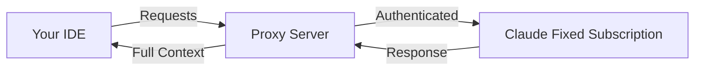

# 🚀 Cursor-Claude Connector

> **Maximize your Claude subscription**: Use Claude's full power in your favorite IDE (like Cursor)

## 🚀 Why use your Claude subscription in an IDE?

Get the best of both worlds by combining Claude's capabilities with a professional development environment:

### 💡 **Claude's Full Capabilities**

- Direct access to Claude's latest models and features
- No token limits from your Claude Max subscription
- Full context understanding without compression
- Handle large files and complex projects seamlessly

### 🛠️ **Professional IDE Experience**

- **Code-first interface**: Built specifically for development workflows
- **File management**: Navigate and edit multiple files effortlessly
- **Version control**: Full git integration and change tracking
- **Extensions & tools**: Access to your IDE's ecosystem

### 💰 **Maximize Your Investment**

- Already paying for Claude Max? Use it everywhere
- No additional API costs or usage limits
- One subscription, multiple environments
- Full value from your Claude subscription

### 🎯 **Perfect for Complex Projects**

- Maintain context across entire codebases
- Work with large files without restrictions
- Extended coding sessions without interruptions
- Professional development workflow

## ⚠️ **Important: Cursor Requirements**

> **Note**: Cursor requires at least the $20/month plan to use agent mode with custom API keys (BYOK - Bring Your Own Key). The free tier only supports basic completions.

## 🔧 How does this project work?

This proxy enables you to use your Claude Max subscription directly in IDEs that support OpenAI-compatible APIs:

- ✅ Your favorite IDE's interface and features
- ✅ Claude's full capabilities from your subscription
- ✅ No additional costs beyond your Claude Max subscription

### Architecture



## 🚀 Two modes

| Mode | Storage | Use case |
|------|---------|----------|
| **Local** | File `.auth/credentials.json` | Single machine, maximum security |
| **Vercel** | Redis (Upstash) | Multi-device, access without your PC on |

> **Why Redis on Vercel?** In serverless, each request can be handled by a different instance. File storage doesn't persist. Add Upstash Redis via [Vercel Marketplace](https://vercel.com/marketplace?category=storage&search=redis) — it auto-injects credentials.

---

## 📍 Local mode (recommended for dev)

No external setup. Tokens are stored in `.auth/credentials.json`.

1. **Clone and configure**

   ```bash
   git clone https://github.com/Maol-1997/cursor-claude-connector.git
   cd cursor-claude-connector
   cp env.example .env
   # Don't configure Redis → file storage is used automatically
   ```

2. **Run**

   ```bash
   npm run start:local
   # or: ./start.sh local
   # or: ./start.sh   (auto-detect)
   ```

3. **Authenticate** → Open `http://localhost:9095/`

4. **Configure Cursor** → Base URL: `http://localhost:9095/v1`

---

## ☁️ Vercel mode (multi-device)

Public URL, accessible without your PC on. **Redis required** — add via Vercel Marketplace.

### One-click deploy

[](https://vercel.com/new/clone?repository-url=https://github.com/Maol-1997/cursor-claude-connector&env=API_KEY&envDescription=API%20key%20to%20secure%20the%20proxy&envLink=https://github.com/Maol-1997/cursor-claude-connector%23api-key&integration-ids=oac_V3R1GIpkoJorr6fqyiwdhl17)

1. Vercel will clone the repo and prompt for `API_KEY` (required for public URL)
2. **Add Redis:** Go to your project → Storage → Connect Redis → Add [Upstash](https://vercel.com/marketplace/upstash) from Marketplace
3. The integration auto-injects `UPSTASH_REDIS_REST_URL` and `UPSTASH_REDIS_REST_TOKEN`
4. Redeploy if needed

### Manual Redis setup

If you prefer to configure Redis yourself:

1. Create a database at [Upstash Console](https://console.upstash.com/)
2. Add to Vercel environment variables:
   - `UPSTASH_REDIS_REST_URL`
   - `UPSTASH_REDIS_REST_TOKEN`
   - `API_KEY`
   - `CORS_ORIGINS` = your Vercel URL

### Add Redis via Vercel Marketplace (free tier)

> **Note:** Vercel KV was discontinued (Dec 2024). Use **Upstash Redis** from the Marketplace — same API, **free tier** (256 MB, 500K commands/month).

1. Open your Vercel project → **Storage** tab
2. Click **Connect Store** → Browse Marketplace
3. Select **[Upstash Redis](https://vercel.com/marketplace/upstash)** → Add Integration
4. Create a new database or link existing — credentials are auto-injected
5. Redeploy your project

See the **[Deployment Guide](DEPLOYMENT.md)** for details.

## 🎉 Advantages of this solution

| Feature                 | Claude Web | Claude Code | **This Project**        |
| ----------------------- | ---------- | ----------- | ----------------------- |
| IDE Integration         | ❌         | ❌ Terminal | ✅ Full IDE             |
| File Management         | ❌         | ✅          | ✅ IDE Native           |
| Claude Max Usage Limits | ✅         | ✅          | ✅ No Additional Limits |
| Version Control         | ❌         | ⚠️          | ✅ Full Git Integration |
| Development Extensions  | ❌         | ❌          | ✅ IDE Ecosystem        |
| Cost                    | Claude Max | Claude Max  | Claude Max Only         |

## 🔐 API Key

- **Local:** optional (proxy is not exposed)
- **Vercel:** strongly recommended, required for a public URL

## 🛡️ Security

- OAuth authentication with Claude
- **Local:** tokens in `.auth/` (gitignored), no network exposure
- **Vercel:** API_KEY required, CORS restricted, tokens in Redis

## 🤝 Contributions

Contributions are welcome! If you find any issues or have suggestions, please open an issue or PR.

## 📄 License

MIT - Use this project however you want

---

**Note**: This project is not affiliated with Anthropic or Cursor. It's a community tool to improve the development experience.
